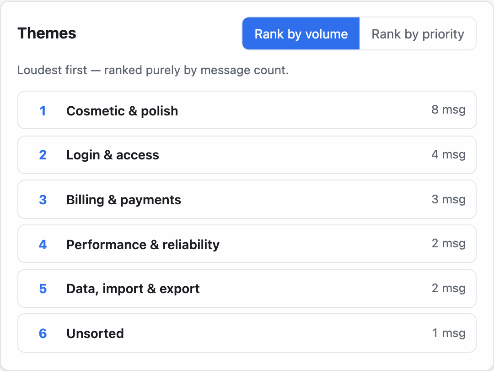

# signal-triage

**Turn a batch of customer-support messages into a ranked list of product themes — then flip between "loudest" and "most important" and watch the order change.** It exists to make one argument concrete: the loudest theme in a support inbox is usually not the one you should build for.



**Live demo:** https://an-zamora.github.io/signal-triage/ · **CI:** 

---

## Your data never leaves your browser

There is no backend, no database, and no request that carries your text anywhere. All parsing, clustering, and scoring run locally. "Your messages never leave your browser" is simultaneously the security posture, the privacy policy, and the product pitch.

This is **enforced, not just asserted.** The page ships a Content-Security-Policy with `connect-src 'self'` ([`index.html`](index.html)), so the app *cannot* make an outbound request even if a dependency tried to. There is no analytics, no telemetry, no third-party fonts, and no error-reporting service. Nothing you paste is written to `localStorage`, `sessionStorage`, or IndexedDB.

## How it works

The app opens with a sample already loaded. Switch between the **Generic SaaS** and **Clinic software** datasets, or hit **Clear** and paste your own — one message per line. Optionally attribute a line to a sender with ` | ` so *reach* counts distinct people:

```
sarah@clinic.com | the export button is broken
```

Messages are grouped into themes by a keyword lexicon you can read and edit in the app (each dataset ships its own), then scored and ranked. Toggle between **Rank by volume** and **Rank by priority** to see the ordering change — the loudest theme drops several places.

## The scoring model

```
priority(theme) = reach × avgSeverity × fit
```

- **reach** — count of *distinct senders* in the group. One person sending five emails is one person; conflating those is how a squeaky wheel captures a roadmap.
- **avgSeverity** — mean of per-message severity, inferred from wording: `blocked = 3`, `friction = 2`, `wish = 1`.
- **fit** — a human input, `0`–`1.5`, default `1.0`. Setting it to `0` marks a theme "not doing it" and parks it at the bottom of the ranking while leaving it visible.

Two decisions worth stating plainly:

1. **Fit is not computed.** Reach and severity are countable; whether something belongs in the product is a judgment. Putting it behind a visible slider keeps that judgment in the open instead of laundering it through a formula.
2. **The lexicon is data, not logic.** You can read it, disagree with it, and edit it in the app. That visibility is a feature.

## Limitations

This is a decision *aid*, not an oracle. It is honest about what it cannot see:

- **Selection bias.** It ranks the people who wrote in. Customers who churned silently, or never hit the problem, are not in the box.
- **Severity is inferred from wording.** A polite report of a real outage can score below an irritated complaint about a font. This is a known weakness, not a solved problem.
- **Customers report solutions, not problems.** "Add a button here" is a guess at a fix; the underlying need may differ.
- **Clustering is keyword matching.** It is inspectable and editable, not clever. Ambiguous messages land in "Unsorted" on purpose rather than being forced into a bucket.

No redaction of PII is performed in this version — see the roadmap.

## Local setup

```bash
npm install
npm run dev      # http://localhost:5173
npm test         # run the domain unit tests
```

## Runtime dependencies

The dependency tree is deliberately tiny; the security story is carried by "no backend, no egress, no secrets." Every runtime dependency earns a line here:

- **react** / **react-dom** — the UI framework. The scoring logic lives in a pure, framework-free `domain/` layer; React only renders it.

That is the entire runtime list. Everything else (Vite, TypeScript, Vitest, ESLint) is a dev/build tool and ships nothing to the browser. No component library, no state manager, no date library, no lodash.

## Architecture

The full spec — decisions, threat model, and CSP rationale — is in [`docs/ARCHITECTURE.md`](docs/ARCHITECTURE.md). The one layering rule worth knowing: **`src/domain/` imports nothing from `ui/`**, has no side effects, and is where all the tested logic lives.

```
src/
  domain/     pure, no DOM, no network, unit-tested — types, lexicon, classify, score
  ui/         React components — App, SourcePanel, ThemeList, ThemeDetail, Caveats, LexiconEditor
  fixtures/   synthetic sample data (clearly labelled, not from any real product)
```

## Roadmap

This is **v0.1** — a complete, defensible core. Deliberately deferred:

- **v0.2 — privacy surface.** A redaction module that masks emails, phone numbers, long digit runs, URLs, and salutation-name patterns, with a "redact on display" toggle for demos. Plus copy-to-clipboard export.
- **v0.3 — optional enrichment.** A bring-your-own-key AI enricher behind a `ThemeEnricher` interface, disabled by default, with redaction forced on before any text is transmitted. It widens the CSP `connect-src` to exactly one origin — and shipping without it remains the stronger security posture.

Helpdesk import (Zendesk/Intercom) is explicitly *not* on this roadmap: OAuth tokens need a backend, which renegotiates every decision above. That is a different product with its own threat model.

## License

[MIT](LICENSE).
